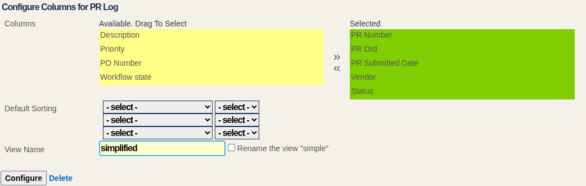

This works with Rails >= 5.2 and ActiveScaffold >= 3.7.1  
Version 3.4.x and 3.5.x worked with Rails >= 4.0 and ActiveScaffold >= 3.4.4  
Version 3.3.x worked with Rails 3.2 and ActiveScaffold >= 3.4.4  
Version 3.2.x worked with Rails 3.2 and ActiveScaffold >= 3.3.0  

Usage:

```rb
active_scaffold :model do |conf|
  conf.actions.add :config_list
end
````


Overview
========

A plugin for Active Scaffold that provides the ability to choose the column to show in the scaffold list at run-time.
Also, it adds the ability to define named views with other set of columns to choose between the default list view and
the named views.

You have the option of defining a default set of columns for the controller. For example:
```rb
config.config_list.default_columns = [:name, :project, :amount]
```

This is useful when you want the option to look at a potentially large number of columns but be able to 
easily reset back to something that fits on the screen without horizontal scrolling.

The available columns in the configure action are the columns defined in `list.columns`. For that reason, if
`config_list.default_columns` is not defined, then it will default to `list.columns`, and the users only will be able
to remove some columns, they won't be able to add other columns.

The configuration data will be saved in the session.

## Named Views

It's possible to define named views, with a set of columns, so users can switch between default view and other defined views. Adding a view is done with `add_view` method, and passing a name (symbol or string) and an array of columns:

```rb
conf.config_list.add_view :simple, [:number, :status]
```

Although it's possible to use a block too, to change other view settings, such as label, sorting and security method. If the label is set, it can be a string, or a symbol to be localized, and the name is used in the URL parameters. When using a block, the columns can be defined in the view instead of the `add_view` call:

```rb
conf.config_list.add_view :simple do |view|
  view.label = 'Number and Status'
  view.columns = [:number, :status]
  view.sorting = {number: :desc}
  view.security_method = :simple_view_authorized?
end
```

The columns defined in the view are not required to be in the `conf.list.columns`, so it's possible to add views including columns that are not available in the normal config list.

The security method is a controller method used to check if the view is available for the user, it must return true when the view is allowed:

```rb
def simple_view_authorized?
  current_user.is_admin?
end
```

When a named view is selected, the configure action link is not rendered.

The view selector is displayed in the title header, and it's rendered as a menu of links, displaying the selected view, and the list of available views on hover. The selector can be changed to a list of radio buttons or select field with `conf.config_list.named_views_selector`,per controller, or it can be changed globally in `ActiveScaffold.defaults`:

```rb
conf.config_list.named_views_selector = :radio  # use radio buttons
conf.config_list.named_views_selector = :select # use select field
conf.config_list.named_views_selector = :links  # use a menu of links (default)
```

The position of the views selector can be changed with `conf.config_list.named_views_position`, setting it to `:center` (default, between the title and actions), `:left` (next to the title) or `:right` (at the right of the actions). Although the position of the `div.config-list-views` doesn't change, it just adds a class (center, right or left) and use CSS of flexbox layout to change the position (changing `flex-grow` and `order`). It can be changed per controller or globally in `ActiveScaffold.defaults`:

```rb
conf.config_list.named_views_position = :center
conf.config_list.named_views_position = :left
conf.config_list.named_views_position = :right
```

## Saving to DB

The configuration data can be saved on the DB. Define a model to store the list configuration, it must have a config_list
text column storing the columns list, and config_list_sort serialized text column, a foreign key for the user and a column
saving the controller name or ID. Also, if using saving named views feature, it must have a column to store the view name,
and a column to store the slug if global views are enabled. For example:

```rb
# == Schema Information
#
# Table name: list_configurations
#
#  id                  :bigint           not null, primary key
#  config_list         :text
#  config_list_sorting :text
#  created_at          :datetime         not null
#  updated_at          :datetime         not null
#  controller_id       :string(255)
#  user_id             :bigint
#  view_name           :string
#  slug                :string
#
# Indexes
#
#  index_list_configurations_on_user_id  (user_id)
#

class ListConfiguration < ApplicationRecord
  belongs_to :user
  serialize :config_list_sorting, JSON
end
```

Then in your user model call `has_config_lists 'ModelName'` to define the `has_many` association to the model storing
the list configuration. The method `has_config_lists` requires a model name, and a hash of options:

* association_name: defaults to `list_configurations`
* association_options: the options for the `has_many` association, for example, `dependent`, `as` if the model has a
polymorphic association because it's used by different user models, foreign_key, and any other option accepted by
`has_many`.
* controller_column: the column storing the controller name or ID.
* controller_matcher: :controller_id, :controller_name, or a proc. If you want to match the controller column with the
controller name or controller ID (see below for the difference between controller name and ID).
* view_name_column: the name for the column storing the view name (see Saving Named Views)
* slug_column: the name of the column storing the slug for the view (see Global Views)

```rb
class User < ApplicationRecord
  has_config_lists 'ListConfiguration', association_options: {dependent: :delete_all}
end
```

Finally, set the setting `config_list.save_to_user` to `:config_list_for` in the controllers using config_list.

```rb
conf.config_list.save_to_user = :config_list_for
```

It can be changed globally for the app in `ActiveScaffold.defaults` in an initializer, such as:

```rb
ActiveScaffold.defaults do |config|
  config.config_list.save_to_user = :config_list_for
end
```

There are 2 ways to store the list configuration for a controller. Saving the controller name or the controller ID.
If the user configuration must be shared on different conditions for embedded controllers, and each parent for nested
controllers, or save unique configurations. The controller ID argument will be different in embedded controllers,
nested controllers and regular controllers, as it will use `active_scaffold_session_storage_key`, and the controller
name will always be the same.

## Saving Named Views

It's possible to save the list configuration with a name, and change between default view, named views defined in the
config and user named views. Config list will have a field to set the name, when no name is set, it's saved as a normal
config list, overriding the default view.

When a user named view is selected, configure will open the form with that view's settings. If the name is changed, a
checkbox will show up that allows renaming the current view. Submitting the form without checking that checkbox will
create a new named view, and will rename the current view if the checkbox is selected. In this case, it isn't possible
to override the default view, clearing the view's name won't be allowed.

Also, when an user named view is selected, the config list form will have a delete link instead of the reset link.



Enabling this feature requires enabling saving views to the DB, with `conf.config_list.save_to_user`, as it will use
the same method to get the named view, and set another method in `conf.config_list.named_views_method`. Both options
can be set per controller, or globally in `ActiveScaffold.defaults`. Set `named_views_method` to `:config_list_views`.

## Global Views

It's possible to define global views, so they are available to all users. It's enabled with `conf.config_list.global_views`, and requires to use `save_to_user` and `named_views_method` too, as they work as saved named views.

When configuring the list, a global view checkbox will show up when the view name is set, but the global checkbox can be
changed only if a new view is going to be created (the name of the view is changed, and rename is unchecked). Otherwise,
global view will be disabled, showing if the view is global or not, but can't be changed until the name is edited.

The user association in ListConfiguration must be set as optional, as global views will be saved without the user
foreign key.

```rb
class ListConfiguration < ApplicationRecord
  belongs_to :user, optional: true
  serialize :config_list_sorting, JSON
end
```

These views require having a name, then when a name is typed, a global view checkbox will show up. It requires another
column in the list configuration model, `slug`, as there may be a name collision, and it's hard to prevent, because
it's weird to forbid creating a global view with a name, because some other user already used it for a private view.
The slug will be built prefixing the view name with `user-` or `global-` by default.

If you want to change how slugs are built globally, you can define a method in ApplicationController, and configure it
with `conf.config_list.slug_builder` in `ActiveScaffold.defaults`. It's a global setting only, can't be set per controller.
To customize slug builder in a controller, define `config_list_slug` in the controller. The `config_list_slug` method,
and the slug builder method, will get the view name and global_view boolean, and must return the slug. It's called when
saving a view. Changing how slugs are generated can break the default `config_list_for` method if the slug for user views
doesn't start with `user-`.

If you want to override a global view with a private view having the same name, so user don't see 2 options with the same
name in the views selector, override `config_list_views` in your user model, after calling `has_config_lists`, and get
uniq views by name:

```rb
def config_list_views(*)
  super.uniq { |(name, _)| name }
end
```

Also, it's possible to override it to change the name of the views, appending an indicator for user views or global views
when the name is not unique.

## Custom model methods

It's possible to write custom code in the user model, instead of using `has_config_lists`. Although it's more
complicated, especially if global views feature is enabled.

Define the `has_many` association in the user model, and the method or methods configured in `save_to_user` and
`named_views_method`.

The method configured in `save_to_user` must return the record storing the list configuration for the requested
controller. The method has 2 arguments, `controller_id` and `controller_name`, so only need to save one of them.

```rb
ActiveScaffold.defaults do |config|
  config.config_list.save_to_user = :config_list_for
end

class User < ApplicationRecord
  has_many :list_configurations, dependent: :delete_all
  def config_list_for(controller_id, controller_name)
    # Use controller_id to allow having different columns on different nested or embedded conditions
    list_configurations.where(controller_id: controller_id).first_or_initialize
    # Or use controller_name for one configuration for the controller, even embedded or nested
    list_configurations.where(controller_id: controller_name).first_or_initialize
  end
end
```

When `named_views_method` is set, the method in `save_to_user` must accept options with double splat (or keyword
arguments `view_name` and `attributes`), and it's responsible to look for a named view for the user using view_name,
and return a new model when none is found. Also, it's responsible to set the view_name from opts[:attributes] (or
`attributes` keyword arg) in the right column. It can use the same model explained before. When selecting the default
view, and saving it, the keyword arguments will be nil.

```rb
  def config_list_for(controller_id, controller_name, **opts)
    list_configurations.where(controller_id: controller_name, view_name: opts[:view_name]).first_or_initialize.tap do |r|
      r.view_name == opts[:attributes][:view_name] if opts[:attributes]
    end
  end
```

The method in `named_views_method` must return an array with the saved named views for the user, and each item will be an array with the label and name in URL parameter (for example, `view_name` and `slug` columns), or just a string to use for both label and name. This method will receive `controller_id` and `controller_name` arguments, just like the method in `save_to_user`.

```rb
ActiveScaffold.defaults do |config|
  config.config_list.named_views_method = :config_list_views
end

class User < ApplicationRecord
  def config_list_views(controller_id, controller_name)
    list_configurations.where(controller_id: controller_name).where.not(view_name: nil).pluck(:view_name)
  end
end
```

When using global views, the method configured in `save_to_user` will get another keyword argument, `slug`, instead of `view_name`, and must use this one to find the view. The `attributes` keyword argument will have `slug` key and
`view_name` key. When the provided slug is for a global view, and no view is found, it shouldn't set the user id, but
when there is no slug, or the slug is for an user view, the user id should be set:

```rb
def config_list_for(controller_id, controller_name, slug: nil, attributes: nil)
  query = list_configurations
  query = ListConfiguration.where(user_id: nil).or(list_configurations) unless slug.to_s.start_with?('user-')
  query.where(controller_id: controller_name, slug: slug).first_or_initialize.tap do |record|
    record.attributes = attributes if attributes
  end
end
```

And the method configured in `named_views_method` should return the view name and the slug, so user see the view name, and slug is used in the URL:

```rb
def config_list_views(controller_id, controller_name)
  list_configurations.or(ListConfiguration.where(user_id: nil)).where.not(slug: nil).pluck(:view_name, :slug)
end
```

It's possible to user other column names than `view_name` and `slug`, just ensure the values are set from `attributes[:view_name]` and `attributes[:slug]`, and use the right column names in the queries.